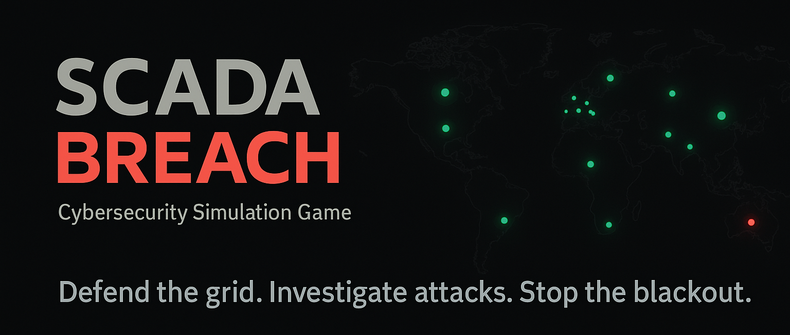

  

# ⚡ OT/ICS Incident Response Simulation

Interactive cyber-security simulation in a fictional continental power grid.

PowerGrid Cyber Crisis is a browser-based cyber range designed to teach
incident response, privilege escalation, log analysis, phishing detection and OT/SCADA security
through an immersive, story-driven scenario.

The participant operates as a grid control center operator in a national grid control center while a ransomware campaign spreads across interconnected power plants.
Your tools: a terminal, internal email system, live news feeds, blue-team dashboard, and plant telemetry.

---

## 🚀 Features

### 🖥️ Realistic terminal sandbox

* Linux-like file system
* Permissions, owners, `/etc/passwd`, `/proc`
* `sudo`, `su`, user switching
* Misconfigurations and escalation vectors
* Hidden credential leak, log analysis, backup exploit
* Fully scripted commands: `ls`, `cat`, `grep`, `find`, `sudo`, `tar`, …

### 🏭 Operational Technology / SCADA simulation

* 40+ fictional power plants
* Hydroelectric, nuclear, solar, geothermal, gas, mixed
* Dynamic incidents & state changes
* Autogenerated configs, logs, and critical directories

### 📨 Internal communication

* Email system with phishing attempts
* Incident reports
* Engineering memos
* Alerts from CERT teams

### 🌍 Live News Feed

- Ransomware-triggered international news
- Country-specific headlines
- Media pressure as a gameplay mechanic

  

### 🗺️ Interactive grid map

- Visualized plant states
- Regional impact tracking
- Cascading incident chains

  

### 🔒 Blue-team workflows

- Investigation-oriented UI panels
- Threat intelligence briefings
- Incident-response task flows

  

---

## 🎯 Simulation Overview

Participants are expected to:

- Monitor alerts and internal communications
- Investigate anomalies using system tools
- Identify root causes and escalation paths
- Make containment decisions under time pressure
- Manage operational impact across the grid

This is not a “hacking simulator”.
It is a blue-team / DFIR / OT-incident-response simulation with experiential learning elements.

---

## 📂 Project structure 

index.html      → Main application structure
style.css       → UI styling
app.js          → Core game logic
terminal.js     → Full terminal emulator + FS + privilege model
mail.js         → Internal email system
news.js         → News orchestration
map.js          → World map
blue-*.js       → Blue team modules (training, tasks, dashboards)
ransom*.js      → Ransomware storyline logic
plants.json     → Master dataset for all facilities

---

## 🏗️ Roadmap

* More terminal challenges
* Advanced SOC/OT scenarios
* Steam/Web release
* This roadmap represents planned future enhancements and may evolve over time.

---

## 🛡️ License
This project is distributed under a proprietary license.
All rights reserved.

No part of the source code, assets, or content may be copied, modified,
or redistributed without explicit permission from the author.

---

## 🤝 Contributing

PRs welcome — especially:

* new scenarios
* terminal commands
* bug fixes
* UI improvements

---

## 🔗 Live Demo

👉 https://scadabreach.com
