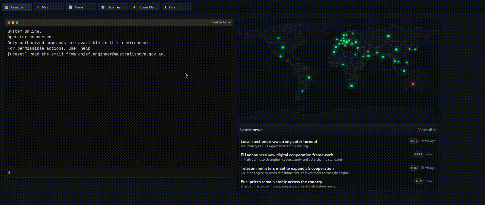

# ⚡ PowerGrid Cyber Crisis — OT/ICS Cyber Range Game

Interactive cyber-security simulation & CTF in a fictional continental power grid.

PowerGrid Cyber Crisis is a browser-based cyber range designed to teach
incident response, privilege escalation, log analysis, phishing detection and OT/SCADA security
through an immersive, story-driven scenario.

You take the role of an operator in a national grid control center while a ransomware campaign spreads across interconnected power plants.
Your tools: a terminal, internal email system, live news feeds, blue-team dashboard, and plant telemetry.

---

## 🚀 Features

### 🖥️ Realistic terminal sandbox

* Linux-like file system
* Permissions, owners, `/etc/passwd`, `/proc`
* `sudo`, `su`, user switching
* Misconfigurations and escalation vectors
* Hidden credential leak, log analysis, backup exploit
* Fully scripted commands: `ls`, `cat`, `grep`, `find`, `sudo`, `tar`, …

### 🏭 Operational Technology / SCADA simulation

* 40+ fictional power plants
* Hydroelectric, nuclear, solar, geothermal, gas, mixed
* Dynamic incidents & state changes
* Config, logs, critical directories autogenerated from `plants.json`

### 📨 Internal communication

* Email system with phishing attempts
* Incident reports
* Engineering memos
* Alerts from CERT teams

### 🌍 Live News Feed

* Ransomware-triggered international news
* Country-specific headlines
* Situational awareness mechanic

  

### 🗺️ Interactive map

* Highlighted compromised sites
* Regional grid impact
* Incident chains

  

### 🔒 Blue-Team mechanics

* Training modules
* Threat intel briefings
* UI panels with tasks
* Investigation workflows

  

---

## 🎮 Gameplay Overview

Your job is to:

1. Read alerts from engineering & CERT.
2. Investigate compromised servers through the terminal.
3. Identify escalation vectors.
4. Contain the incident and secure critical plants.
5. Uncover the ransomware actor’s method & clean the system.

This is not a “hacking simulator”.
It is a blue-team / DFIR / OT-incident-response experience with CTF elements.

---

## 📂 Project structure 

index.html      → Main application structure
style.css       → UI styling
app.js          → Core game logic
terminal.js     → Full terminal emulator + FS + privilege model
mail.js         → Internal email system
news.js         → News orchestration
map.js          → World map
blue-*.js       → Blue team modules (training, tasks, dashboards)
ransom*.js      → Ransomware storyline logic
plants.json     → Master dataset for all facilities

---

## 🏗️ Roadmap

* More terminal challenges
* Advanced SOC/OT scenarios
* Steam/Web release
* This roadmap represents planned future enhancements and may evolve over time.

---

## 🛡️ License
This project is distributed under a proprietary license.
All rights reserved.

No part of the source code, assets, or content may be copied, modified,
or redistributed without explicit permission from the author.

---

## 🤝 Contributing

PRs welcome — especially:

* new scenarios
* terminal commands
* bug fixes
* UI improvements

---

## 🔗 Live Demo

👉 https://scadabreach.com
